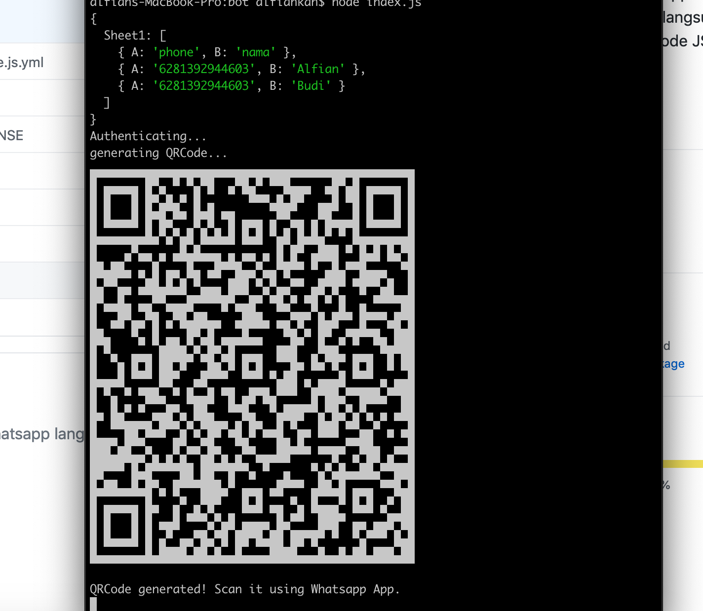

> Bulk Send Whatsapp Message
> Kirim pesan whatsapp langsung ke banyak nomor dengan Node JS
> Feature => data dari Excell (.xlsx)

 

> STEP  :

- Clone atau Download repository ini
- jalankan `npm install` atau
- `npm install wbm` dan `npm install convert-excel-to-json`
- isikan nomor pada file excell
- jalankan `node index.js`
- akan tampil qrcode pada terminal lalu scan
- Proses mengirim dimulai

> Module :

- convert-excel-to-json
- wbm

- Contact Me : git@alfiankan.com